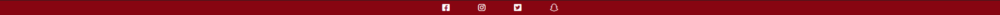
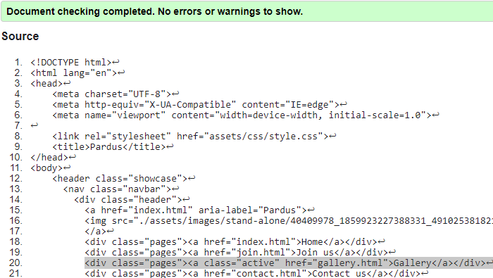

<h1>Pardus - Milestone Project 1.</h1>

<h1>User Experience</h1><ul>
<li><h2>First time users<h2></li>
First time users should experience an immediate explanation of what the website is about and what it stands for judging by the Logo as well as the home page’s text box and the image below. With a working navigation bar at the top reacting to their mouse hovering over and moving between pages will leave the current page text bigger than the rest indicating where you are.
First time users should also find the website easy to use and navigate around and being 

<li><h2>Regular users</h2></li>
Regular users already know what the website stands for and will tend to return to the website being either a member or seeing what the club is currently up to.
Example - Browsing the website whether that being the gallery or even contacting the club via the contact page.</ul>
<h1>Design</h1>
<h2>Purpose</h2>
The Purpose of this website Is to increase the efficiency of the club and to give back to a sport whom I fell in love with. Judo, I sustained an injury during one of the training sessions and have not been able to get back into it but this way I can give back to the community and the sport and the wonderful  people who organizing the trainings and effort brought to them can be made easier and simpler for everyone.

<h2>Translation</h2> 
The information gathered on the website was gathered from Icelandic news sites as well as speaking to members of the club and then translated from native Icelandic to English.

<h2>Wireframes</h2>
<h3>Home</h3>

<h3>Join us</h3>

<h3>Gallery</h3>

<h3>Contact us</h3>

<h2>Colour Scheme</h2></li>
<ul>
<li>White (#ffffff) text used to make it easier for the letters to popout</li>
<li>Dark red (#870511) used to symbolize the color of the logo</li>
<li>Very dark gray (#222222) used to symbolize the color of the logo and to have an opposite color against the text to make them both stand out for the visually</li>
</ul>
<h1>Structure</h1>
All pages contain a navigation menu at the top of the website pages that directs them to the following pages "Home, Join us, Gallery, Contact us" to easily allow users to navigate the site as well as a logo. 
As well as a fixed footer for convenience to gain popularity and more members.
<h1>Deployment</h1>
<ul>
<h2>Using Github Pages</h2>
<li>Navigate to the GitHub <a href="https://github.com/LittleCanOpener/Milestone-Project-1" target="_blank">Repository</a>:</li>
<li>Click the 'Settings' Tab.</li>
<li>Scroll Down to the Git Hub Pages Heading.</li>
<li>Select 'Master Branch' as the source.</li>
<li>Click the Save button.</li>
<li>Click on the link to go to the live deployed page.</li></ul>
<h2>Here Is Mine</h2>
Hosted via Github Pages :
<a href="https://littlecanopener.github.io/Milestone-Project-1/" target="_blank">Here</a>

<ul><h2>Run Locally</h2>
<li>Navigate to the GitHub <a href="https://github.com/LittleCanOpener/Milestone-Project-1" target="_blank">Repository</a>:</li>
<li>Click the Code drop down menu.</li>
<li>Either Download the ZIP file, unpackage locally and open with IDE (This route ends here) OR Copy Git URL from the HTTPS dialogue box.</li>
<li>Open your developement editor of choice and open a terminal window in a directory of your choice.</li>
<li>Use the 'git clone' command in terminal followed by the copied git URL.
A clone of the project will be created locally on your machine.</li></ul>

<h1>Features</h1>
<h2>Header :</h2>

<ul>
<li>Contains a navigation bar with four pages that will react to mouse movement.</li>
<li>Active pages will remain bigger and heavier to let users know where they are.</li>
<li>Company Logo.</li></ul>

<h2>Footer :</h2>
<ul>
<li>Contains icon that links to social media.</li>
<li>Footer fixed inplace to make it more convenient for the sport it self visually and the club to gain popularity</li>
</ul>

<h2>Home :</h2>

<ul>
<li>Contains an entery to the club, meant to capture the attention of viewers.</li>
<li>Contains an image of students</li>
</ul>

<h2>Join us :</h2>

<ul>
<li>Schedules of trainings</li>
<li>Location</li>
<li>Google Map</li>
<li>Image of Kanō Jigorō, founder of Judo</li>
</ul>

<h2>Gallery :</h2>

<ul>
<li>Images from 2015</li>
</ul>

<h2>Contact us :</h2>

<ul>
<li>Contact page for any client or general questions</li>
</ul>

<h1>Known Bugs</h1>
<ol>
<li>Images don't have "Alts"</li>
<li>Google maps not staying in place for mobile devices</li>
</ol>

<h1>Solved Bugs</h1>
<ol>
<li>Fixed</li>
<li>Fixed</li>
</ol>

<h1>Technologies</h1>

<h3>Font Awesome:</h3>
<a href="https://fontawesome.com/" target="_blank">Font Awesome</a>

Was used for the media icons used in the footer.

<h3>Google Fonts:</h3>
<a href="https://fonts.google.com/" target="_blank">Google Fonts</a>

Was used for all the text content on the site pages.

<h3>GitPod:</h3>
<a href="https://www.gitpod.io/" target="_blank">GitPod</a>

Was used to write up the code for my project and using the GitPod terminal to commit everything to GitHub.

<h3>GitHub:</h3>
<a href="https://github.com/" target="_blank">GitHub</a>

Was used to store all the code for this project after being pushed from GitPod.

<h3>Google Chrome Developer Tools:</h3>

Developer Tools was used for trouble shooting and trying new visual changes without it affect the current code already created.

<h3>Google Maps:</h3>
<a href="https://www.google.com/maps/" target="_blank">Google Maps</a>

Google Maps used to pinpoint the location of the club for further information

<h3>Lighthouse:</h3>
<a href="https://chrome.google.com/webstore/detail/lighthouse/blipmdconlkpinefehnmjammfjpmpbjk/related?hl=en" target="_blank">Lighthouse Extension</a>

Was used to analyze the following aspects of a URL: Performance, Progressive Web App, Accessibility, Best Practices and SEO.

A high Lighthouse score also means that you have a well performing website. The speed that a page loads at is extremely important as users do not want to sit around waiting for your webpage to load.

<h4>How to access Lighthouse without Extension:</h4>
<ol><li>On any website if you are on windows you can press F12 on your keyboard and it will open the developer tool. From there you can access Lighthouse</li>
<li>You can also right click on pages and click "Inspect" and you'll have the same pathway to Lighthouse through developer tools.</li></ol>

<h3>HTML:</h3>
<a href="https://en.wikipedia.org/wiki/HTML" target="_blank">HTML</a>

Was used to construct the core of the website.

<h4>Why HTML :</h4>HTML code ensures the proper formatting of text and images for Internet browsers. Without HTML, a browser would not know how to display text as elements or load images or other elements.

<h3>CSS:</h3>
<a href="https://en.wikipedia.org/wiki/CSS" target="_blank">CSS</a>

Was used to style the website after the core was made.

<h4>Why CSS :</h4>CSS makes the front-end of a website shine and it creates a great user experience. Without CSS, websites would be less pleasing to the eye and likely much harder to navigate. In addition to layout and format, CSS is responsible for font color and more.

<h1>Testing</h1>
<h3>Code Validators</h3>
<ul>
<li>W3C <a href="https://validator.w3.org/nu/#textarea" target="_blank">HTML</a> Validator Results:<table><tr><h3>Home - <strong>PASSED</strong></h3></tr><tr><h3>Join us - <strong>PASSED</strong></h3></tr><tr><h3>Gallery - <strong>PASSED</strong></h3></tr><tr><h3>Contact us - <strong>PASSED</strong></h3></tr></table></li>
<li>W3C <a href="https://jigsaw.w3.org/css-validator/#validate_by_input" target="_blank">CSS</a> Validator Results - <strong>PASSED</strong></li>
<li>All links to external websites must open in a new browser</li>
</ul>
<h2>Lighthouse:</h2>

<strong>Performance : </strong>refers to the speed in which web pages are downloaded and displayed on the user's web browser. Website performance optimization, or website optimization is the field of knowledge about increasing web performance

<strong>Accessibility : </strong>means that websites, tools, and technologies are designed and developed so that people with disabilities can use them. More specifically, people can: perceive, understand, navigate, and interact with the website.

<strong>Best Practices : </strong>are related to how to carry out a task or configure something. Strict best practice guidelines may be set by a governing body or may be internal to an organization.

<strong>SEO : </strong> stands for 'Search Engine Optimization', which is the process of getting traffic from free, organic, editorial, or natural search results in search engines. It aims to improve your website's position in search results pages. Remember, the higher the website is listed, the more people will see it.

<h3>Desktop:</h3>

<h3>Moblie:</h3>

<h1>Special Thanks & Acknowledgements</h1>
<table><tr>
<th>Mentor<h3>Ronan McClelland</h3></th>
</tr><tr>
<th>Community Executive<h3>Lane Sawyer<h3></th>
</tr></table>
<h3>For Information</h3> Translated by me from native Icelandic to English
<ul>
<li><a href="https://www.mbl.is/sport/frettir/2014/11/10/gjorbreytt_adstada_fyrir_judo_a_blonduosi/" target="_blank">MBL</a></li>
<li><a href="http://hedinsfjordur.is/nordurlandsmot-i-judo-a-blonduosi/" target="_blank">Héðinsfjörður</a></li>
<li><a href="https://www.feykir.is/is/frettir/aefingabudir-i-judo-a-blonduosi" target="_blank">Feykir</a></li>
<li><a href="https://www.huni.is/index.php?pid=32&cid=13659" target="_blank">Húni</a></li>
<li><a href="http://www.tindastoll.is/judo/moya/news/aefingabuidir-i-judo-a-blonduosi" target="_blank">Tindastóll</a></li>
<h4>English Website</h4>
<ul><li><a href="https://www.wikipedia.org/">Wikipedia</a></li></ul>
</ul>

<h3>CSS Styling & HTML Code</h3>
<ul>
<li><a href="https://www.w3schools.com/" target="_blank">W3schools</a></li>
<li><a href="https://www.freecodecamp.org/" target="_blank">Free Code Camp</a></li>
<li><a href="https://css-tricks.com/snippets/css/a-guide-to-flexbox/" target="_blank">CSS-Tricks</a></li>
<li><a href="https://developer.mozilla.org/en-US/docs/Web/HTML/Element/li" target="_blank">MDN Web Docs</a></li>
<li><a href="https://github.com/AakashRao-dev/CSS-Cheatsheets" target="_blank">AakashRao-dev</a></li>
</ul>
<h4>Inspired by the Love Running Project from: <a href="https://codeinstitute.net/" target="_blank">Code Institute</h4></a>
<ul><li><a href="https://learn.codeinstitute.net/courses/course-v1:CodeInstitute+LR101+2021_T1/courseware/4a07c57382724cfda5834497317f24d5/f2db5fd401004fccb43b01a6066a5333/" target="_blank">Code Institute: Love Running Project</a></li></ul>

<h3>Images:</h3>
<ul>
<li><a href="https://www.facebook.com/judofelagidpardus/" target="_blank">Pardus
</a>Facebook Page
<li><a href="https://commons.wikimedia.org/wiki/Category:Kan%C5%8D_Jigor%C5%8D" target="_blank">Wikimedia</a></li>
</ul>

<h2>Comments</h2>
Git commits will show another page as I started on but I toke ecommerce route and was adviced to let that wait as I don't necessary have the skill set to achieve what I had in mind this advice was given by my Mentor whom I do not regret heeding his advice.